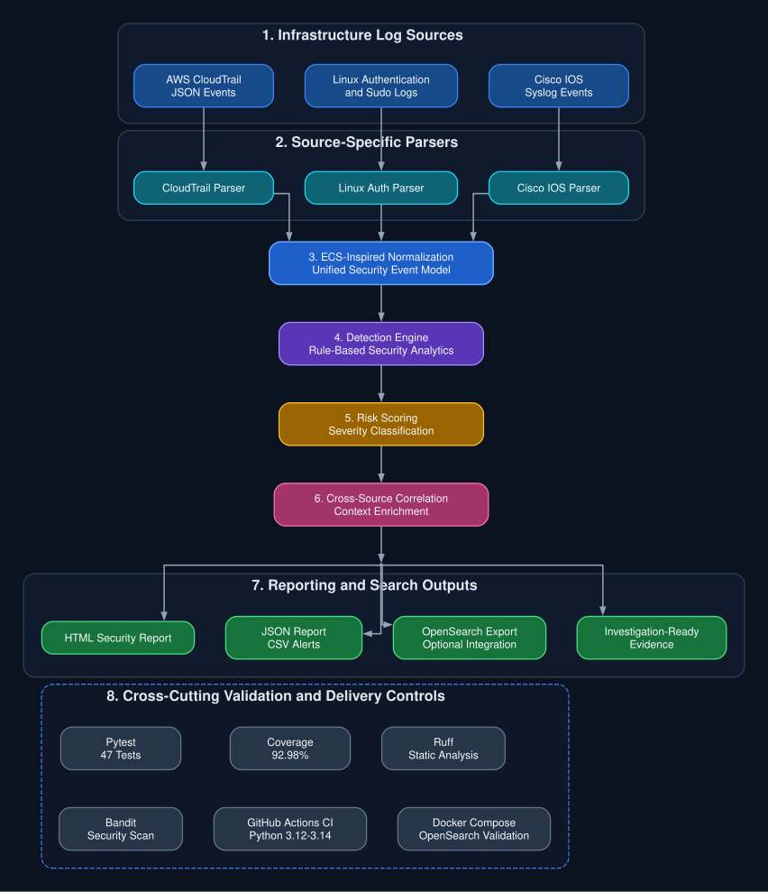
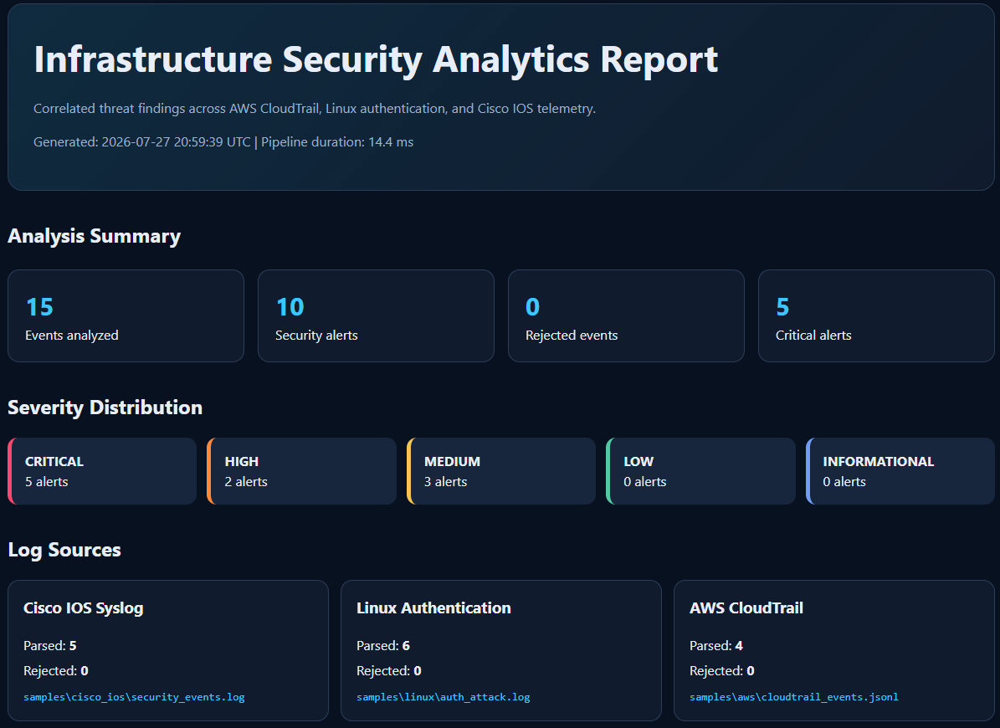
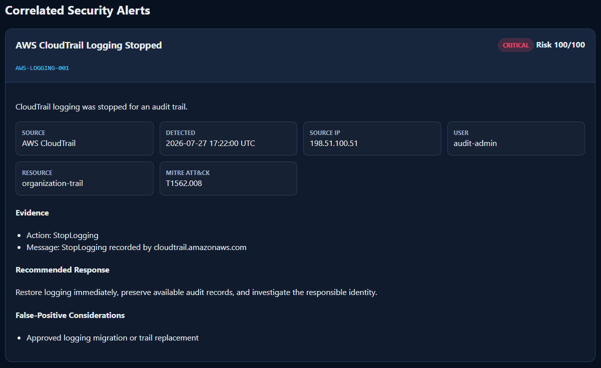
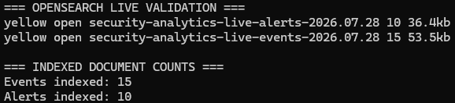
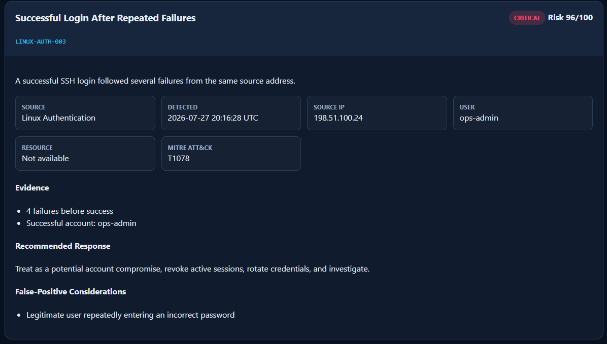
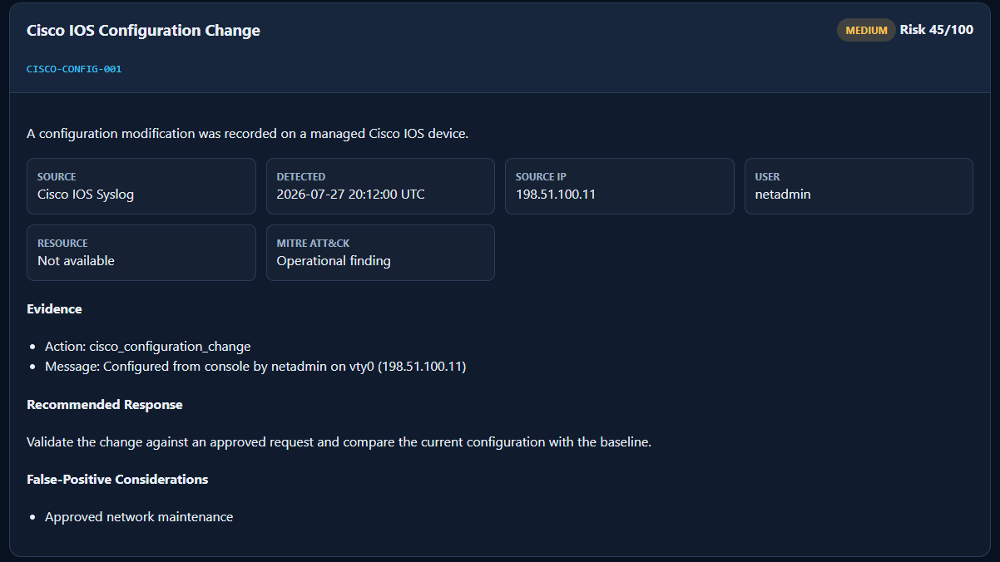
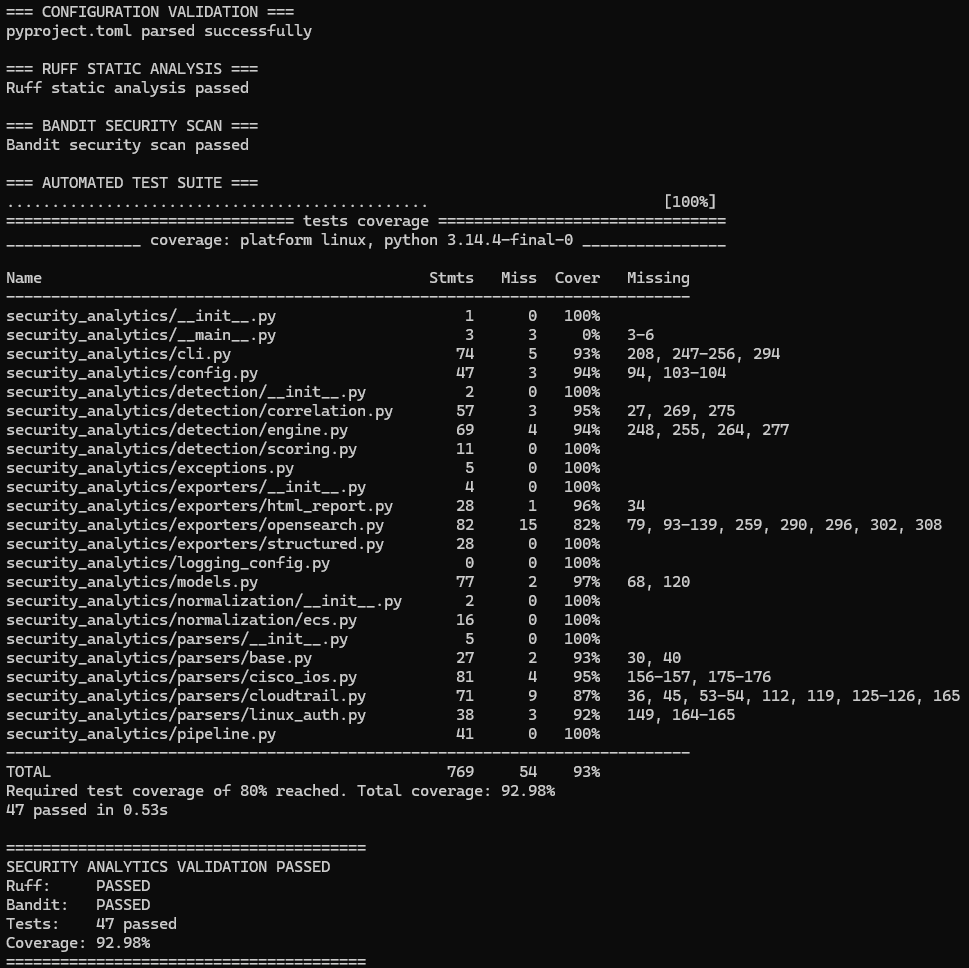
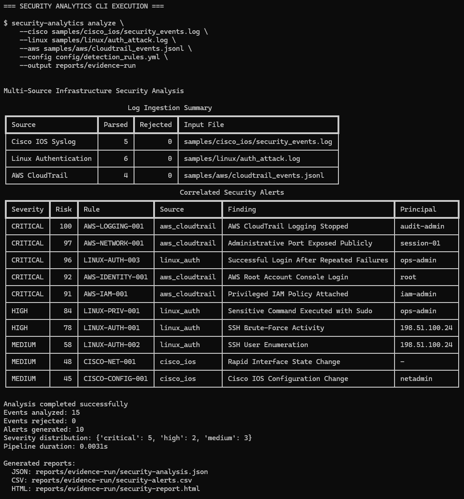

# Infrastructure Security Analytics

[](https://github.com/MansourMutlaq/infrastructure-security-analytics/actions/workflows/ci.yml)


A multi-source security analytics pipeline for parsing, normalizing, detecting,
scoring, correlating, and reporting suspicious activity across AWS CloudTrail,
Linux authentication logs, and Cisco IOS infrastructure telemetry.

The project demonstrates practical security engineering concepts commonly used
in cloud infrastructure monitoring, detection engineering, and SIEM pipelines.

<details>
<summary><strong>Table of Contents</strong></summary>

- [Why It Matters](#why-it-matters)
- [Engineering Ownership](#engineering-ownership)
- [Overview](#overview)
- [Architecture](#architecture)
- [Key Capabilities](#key-capabilities)
- [Processing Pipeline](#processing-pipeline)
- [Detection Coverage](#detection-coverage)
- [Risk Classification](#risk-classification)
- [Analysis Evidence](#analysis-evidence)
- [Quick Start](#quick-start)
- [OpenSearch Integration](#opensearch-integration)
- [Quality and Security Validation](#quality-and-security-validation)
- [Continuous Integration](#continuous-integration)
- [Engineering Challenges and Solutions](#engineering-challenges-and-solutions)
- [Security Design](#security-design)
- [Project Structure](#project-structure)
- [Current Limitations](#current-limitations)
- [Roadmap](#roadmap)
- [License](#license)

</details>

## Why It Matters

Cloud, operating system, and network telemetry rarely arrive in a shared schema. When those sources remain isolated, security teams lose investigation context across identities, addresses, resources, and timestamps.

This project demonstrates a practical approach for unifying AWS CloudTrail, Linux authentication, and Cisco IOS telemetry into one security analytics pipeline. It applies deterministic detections, risk scoring, and cross-source correlation before producing investigation-ready reports and optional OpenSearch indices.

## Engineering Ownership

I designed and implemented this repository as an end-to-end infrastructure security analytics project. The work includes source-specific parsers, an ECS-inspired event model, YAML-configured detection rules, risk scoring, cross-source correlation, HTML/JSON/CSV reporting, optional OpenSearch indexing, Docker-based local validation, automated testing, and multi-version GitHub Actions CI.

Architecture decisions, implementation trade-offs, encountered problems, current limitations, and planned extensions are documented so that the repository can be reviewed and reproduced rather than treated as a black-box demonstration.

## Overview

Infrastructure environments produce telemetry in incompatible formats:

- AWS CloudTrail events use structured JSON.
- Linux authentication events use syslog-style text.
- Cisco IOS events use vendor-specific network log formats.

This project converts those heterogeneous records into a shared security event
model, applies deterministic detection rules, assigns risk scores, correlates
related activity, and exports investigation-ready reports.

## Architecture



The diagram separates the runtime analytics pipeline from the cross-cutting validation and delivery controls. The dashed assurance layer is not part of the runtime event flow.

Detailed architecture and design decisions are documented in [docs/architecture.md](docs/architecture.md).

## Key Capabilities

- AWS CloudTrail JSON Lines parsing
- Linux SSH, authentication, and sudo event parsing
- Cisco IOS security and configuration event parsing
- ECS-inspired event normalization
- Rule-based threat detection
- Risk scoring and severity classification
- Cross-source event correlation
- MITRE ATT&CK technique mapping
- HTML, JSON, and CSV reporting
- OpenSearch-compatible document export
- Typer-based command-line interface
- Automated quality, security, and test validation
- Multi-version CI for Python 3.12, 3.13, and 3.14

## Processing Pipeline

1. **Ingestion**
   Source-specific parsers read AWS, Linux, and Cisco telemetry.

2. **Normalization**
   Events are converted into a common ECS-inspired security model.

3. **Detection**
   Deterministic rules evaluate normalized events for suspicious behavior.

4. **Risk Scoring**
   Alerts receive a numerical risk score and severity classification.

5. **Correlation**
   Related signals are combined into higher-context security findings.

6. **Reporting**
   Results are exported as HTML, JSON, CSV, or OpenSearch documents.

## Detection Coverage

The sample environment demonstrates detections and correlations including:

- AWS CloudTrail logging disruption
- Suspicious AWS identity and access activity
- Repeated Linux authentication failures
- Successful login after repeated failures
- Suspicious privileged Linux commands
- Cisco configuration and security events
- Cross-source infrastructure activity correlation

Detection outputs can include:

- Rule identifier
- Alert title and description
- Severity and risk score
- MITRE ATT&CK techniques
- Source address
- User identity
- Resource context
- Matched indicators
- Supporting event evidence

## Risk Classification

| Risk score | Severity |
|---:|---|
| 90-100 | Critical |
| 70-89 | High |
| 40-69 | Medium |
| 20-39 | Low |
| 0-19 | Informational |

All severity boundaries are validated through parameterized automated tests.

## Analysis Evidence

The following evidence was generated from the included synthetic telemetry and the validated local execution path.

### Security Report Overview



### AWS Critical Detection



### Live OpenSearch Indexing



### Linux Correlation Alert



### Cisco IOS Detection



### Automated Validation



### CLI Analysis Results



## Quick Start

### Requirements

- Python 3.12 or newer
- Git
- Optional: Docker and Docker Compose for local OpenSearch validation

### Installation

```bash
git clone https://github.com/MansourMutlaq/infrastructure-security-analytics.git
cd infrastructure-security-analytics

python3 -m venv .venv
source .venv/bin/activate

python -m pip install --upgrade pip
python -m pip install -e ".[dev]"
```

### Run the Sample Analysis

```bash
security-analytics analyze \
  --cisco samples/cisco_ios/security_events.log \
  --linux samples/linux/auth_attack.log \
  --aws samples/aws/cloudtrail_events.jsonl \
  --config config/detection_rules.yml \
  --output reports
```

Generated outputs include:

```text
reports/
├── security-alerts.csv
├── security-analysis.json
└── security-report.html
```

Operational reports are intentionally excluded from Git because they may
contain environment-specific data.

### Display CLI Help

```bash
security-analytics --help
```

## OpenSearch Integration

OpenSearch export is optional and failure-isolated from the primary analysis workflow.
Local HTML, JSON, and CSV reports remain available if OpenSearch is unavailable.

Start the local development environment:

```bash
docker compose up -d
docker compose ps
```

Run the pipeline with live indexing:

```bash
security-analytics analyze \
  --cisco samples/cisco_ios/security_events.log \
  --linux samples/linux/auth_attack.log \
  --aws samples/aws/cloudtrail_events.jsonl \
  --config config/detection_rules.yml \
  --output reports/live-opensearch \
  --opensearch-endpoint http://localhost:9200 \
  --opensearch-index-prefix security-analytics-live
```

The validated live run indexed **15 normalized events** and **10 correlated alerts**.

A `yellow` index state is expected in the included single-node environment because replica shards cannot be assigned to a second node. Primary shards remain available for indexing and queries.

The Docker configuration disables the OpenSearch security plugin for local validation only. Production deployment requires TLS, authentication, authorization, private networking, managed secrets, monitoring, index templates, and lifecycle policies.

Stop the local environment when finished:

```bash
docker compose down
```

## Quality and Security Validation

The current validation baseline includes:

| Control | Result |
|---|---:|
| Automated tests | 47 passed |
| Statement coverage | 92.98% |
| Minimum CI coverage | 80% |
| Risk-scoring coverage | 100% |
| Ruff static analysis | Passed |
| Bandit security scan | No findings |
| Dependency validation | Passed |
| CLI smoke test | Passed |
| Local path-disclosure regression test | Passed |
| Live OpenSearch indexing | 15 events and 10 alerts |

Run the complete local validation suite:

```bash
python -m ruff check security_analytics tests

python -m bandit \
  -c pyproject.toml \
  -r security_analytics

python -m pytest \
  --cov=security_analytics \
  --cov-report=term-missing \
  --cov-fail-under=80

python -m pip check
security-analytics --help
```

## Continuous Integration

GitHub Actions automatically runs:

- Dependency validation
- Ruff static analysis
- Bandit security scanning
- CLI smoke testing
- Automated tests with coverage enforcement
- Python 3.12, 3.13, and 3.14 compatibility tests

The workflow uses read-only repository permissions, execution timeouts, and
concurrency cancellation for superseded runs.

## Engineering Challenges and Solutions

Detailed implementation decisions and trade-offs are documented in [`docs/engineering-notes.md`](docs/engineering-notes.md).

| Challenge | Resolution |
|---|---|
| Incompatible AWS, Linux, and Cisco formats | Dedicated parsers feed a shared normalized event model |
| Isolated events lacked investigation context | Cross-source correlation combines identities, addresses, resources, and timestamps |
| Severity boundaries were not fully tested | Parameterized tests now validate every scoring boundary |
| HTML reports exposed local filesystem paths | Reports retain safe filenames while removing workstation directory paths |
| Windows and WSL introduced path and line-ending differences | Linux validation, isolated environments, and `.gitattributes` enforce consistency |
| Generated reports and coverage files created repository noise | Runtime artifacts are excluded through `.gitignore` |
| Security claims required repeatable evidence | Ruff, Bandit, Pytest, coverage, dependency checks, and CI provide automated validation |

## Security Design

- No hardcoded credentials, tokens, or AWS access keys
- Environment files and private keys excluded from Git
- Synthetic sample identities and documentation-safe IP addresses
- Local workstation paths removed from generated reports
- Runtime reports and temporary test artifacts excluded from source control
- Bandit security scanning executed locally and in CI
- GitHub Actions restricted to read-only repository permissions

## Project Structure

```text
.
├── .github/
│   └── workflows/
│       └── ci.yml
├── config/
│   └── detection_rules.yml
├── docs/
│   ├── architecture.md
│   ├── engineering-notes.md
│   ├── diagrams/
│   │   └── architecture.dot
│   └── evidence/
├── reports/
├── samples/
│   ├── aws/
│   ├── cisco_ios/
│   └── linux/
├── security_analytics/
│   ├── detection/
│   ├── exporters/
│   ├── normalization/
│   ├── parsers/
│   ├── cli.py
│   ├── config.py
│   ├── models.py
│   └── pipeline.py
├── templates/
├── tests/
├── docker-compose.yml
└── pyproject.toml
```

## Current Limitations

- The current implementation is batch-oriented rather than real-time.
- Detection thresholds require tuning for each organization.
- Included telemetry is synthetic and intentionally limited in size.
- OpenSearch integration is designed for local validation and demonstration.
- The system is an engineering portfolio project, not a replacement for a
  production SIEM platform.

## Roadmap

Planned extensions include:

- Amazon S3 and AWS Security Lake ingestion
- Amazon Kinesis or Apache Kafka streaming
- Sigma-compatible detection rules
- Windows Event Log and firewall parsers
- Threat-intelligence enrichment
- Detection suppression rules and allowlists
- OpenSearch dashboards and alerting
- Terraform-based AWS deployment
- Larger datasets and performance benchmarking

## License

This project is licensed under the MIT License. See [`LICENSE`](LICENSE).
