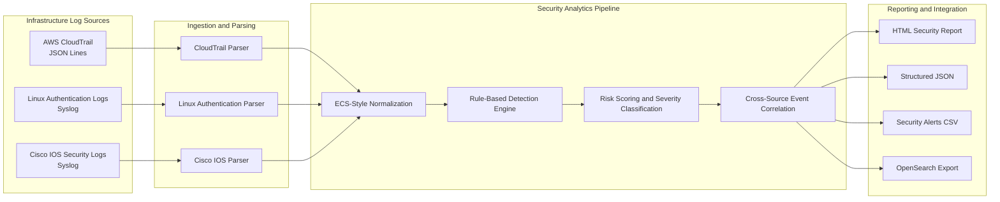

# System Architecture

## Overview

Security Log Analyzer is a batch-oriented security analytics pipeline that
ingests heterogeneous infrastructure logs, converts them into a normalized
event model, executes detection and correlation logic, assigns risk scores,
and generates structured security reports.

## Architecture Diagram

## Processing Stages

### 1. Source-Specific Parsing

Each supported source uses a dedicated parser:

- `CloudTrailParser` processes AWS CloudTrail JSON Lines events.
- `LinuxAuthParser` processes Linux authentication and sudo events.
- `CiscoIOSParser` processes Cisco IOS security and configuration events.

Source-specific parsing isolates format differences and allows new parsers to
be added without changing the downstream analytics pipeline.

### 2. Event Normalization

Parsed records are converted into a shared security event model inspired by
Elastic Common Schema. Normalization provides consistent timestamps,
identities, source addresses, resources, categories, and raw-event context.

### 3. Detection Engine

The detection engine evaluates normalized events using deterministic security
rules. Generated alerts include:

- Rule identifiers
- Risk scores and severity levels
- MITRE ATT&CK mappings
- Matched indicators
- Identity and source context
- Supporting event evidence

### 4. Risk Scoring

| Risk score | Severity |
|---:|---|
| 90-100 | Critical |
| 70-89 | High |
| 40-69 | Medium |
| 20-39 | Low |
| 0-19 | Informational |

Severity boundary behavior is verified through parameterized automated tests.

### 5. Cross-Source Correlation

Correlation logic combines related AWS, Linux, and Cisco signals using
timestamps, identities, source addresses, resources, and detection context.

This allows related activity to be represented as a correlated incident rather
than several isolated alerts.

### 6. Reporting and Integration

Analysis results can be exported as:

- Human-readable HTML reports
- Structured JSON documents
- CSV security alert records
- OpenSearch-compatible documents

Generated reports are excluded from source control. Sanitized execution
evidence is maintained under `docs/evidence/`.

## Security Design Decisions

- No hardcoded credentials, access keys, or tokens
- Environment files and runtime secrets excluded from Git
- Absolute workstation paths removed from generated reports
- Safe source filenames preserved for investigation context
- Synthetic sample identities and documentation-safe IP addresses
- Bandit security scanning executed locally and in CI
- Read-only GitHub Actions repository permissions
- Minimum automated test coverage enforced at 80%

## Reliability and Quality Controls

The project currently validates:

- 40 automated tests
- 94.20% statement coverage
- 100% risk-scoring boundary coverage
- Ruff static analysis
- Bandit security scanning
- Dependency consistency through `pip check`
- CLI installation and smoke testing
- Python 3.12, 3.13, and 3.14 through GitHub Actions

## Engineering Challenges and Resolutions

### Heterogeneous Log Formats

AWS CloudTrail, Linux authentication logs, and Cisco IOS logs use different
formats and security semantics.

**Resolution:** Dedicated source parsers feed a shared normalized security
event model.

### Cross-Source Correlation

Individual events may appear harmless until evaluated as part of a sequence
across cloud, operating system, and network infrastructure.

**Resolution:** Correlation rules combine timestamps, source addresses,
identities, resources, and matched indicators.

### Report Path Disclosure

Early HTML reports exposed absolute local filesystem paths.

**Resolution:** Reports now expose safe source filenames only. Regression tests
verify that the active repository path is absent from generated reports.

### Cross-Platform Development

Development across Windows and WSL introduced filesystem path and line-ending
differences.

**Resolution:** Linux-based validation, isolated virtual environments, and
`.gitattributes` provide consistent repository behavior.

### Generated Operational Artifacts

HTML, JSON, CSV, coverage, and temporary test outputs can contain
environment-specific information and create unnecessary Git noise.

**Resolution:** Generated artifacts are excluded through `.gitignore`, while
sanitized screenshots are stored separately as documentation evidence.

## Current Limitations

- Analysis is batch-oriented rather than real-time streaming.
- Detection thresholds require organization-specific tuning.
- Included sample telemetry is synthetic and intentionally limited in size.
- OpenSearch integration is designed for local validation and demonstration.
- The project does not replace a production SIEM platform.

## Future Architecture

Planned extensions include:

- Amazon S3 and AWS Security Lake ingestion
- Amazon Kinesis or Apache Kafka streaming pipelines
- Sigma-compatible detection rules
- Windows Event Log and firewall parsers
- Threat-intelligence enrichment
- Detection suppression rules and allowlists
- OpenSearch dashboards and alerting
- Terraform-based AWS deployment
- Performance testing with larger datasets
